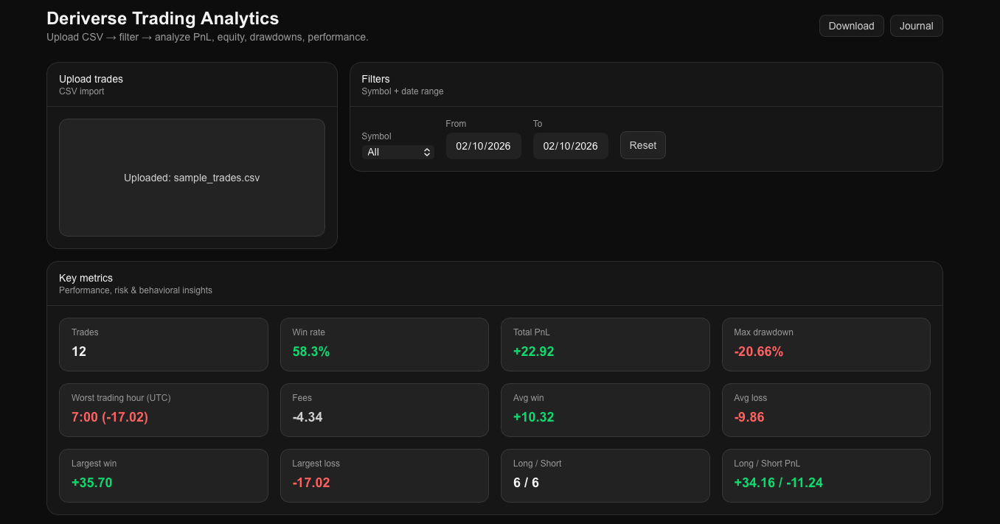
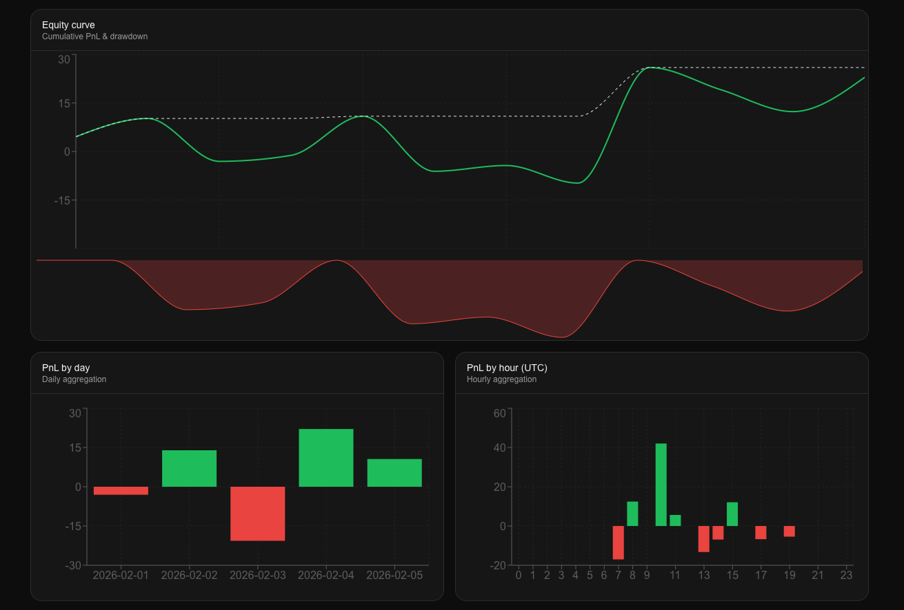
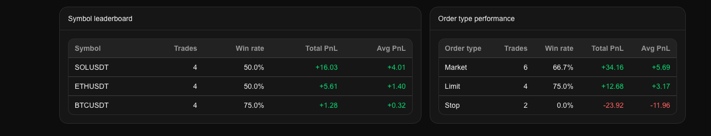
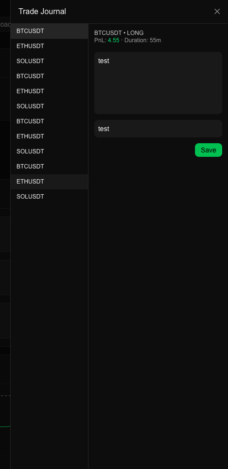

# Deriverse Trading Analytics
Professional trading analytics & journaling dashboard for active traders.
Built as a next-gen analytics companion for the Deriverse ecosystem.

A comprehensive, client-side trading analytics solution focused on performance, risk management, and behavioral insights.

## Dashboard Preview

### Welcome



## 📊 Equity & Drawdown



## 📋 Trades Table



## 📝 Journal




# Getting Started
Run the development server:

```
npm install
npm run dev
```

Open
```http://localhost:3000```
to view the dashboard in your browser.


## Overview
Deriverse Trading Analytics is a fully client-side trading analytics and journaling dashboard designed for active traders who want deep insight into their performance.
The application transforms raw trade history data into clear performance metrics, risk indicators, and behavioral insights, while also providing a professional trade journal for post-trade analysis.

All analytics are performed locally in the browser.
No backend, no wallets, no external APIs, no data leakage.


## Key Features
## Performance Analytics
- Total net and gross PnL tracking
- Equity curve with peak & drawdown visualization
- Win rate and total trade count
- Largest winning and losing trades
- Average win and average loss
- Average trade duration


## Risk & Directional Bias
- Long / Short trade distribution
- Long / Short PnL comparison
- Maximum drawdown (numeric + visual)
- Order type performance (Market / Limit)
- Risk exposure through equity drawdowns


## Time-Based Performance
- Daily PnL aggregation
- Hour-of-day PnL analysis (UTC)
- Worst trading hour insight (behavioral analysis)


## Behavioral Insights
- Identification of underperforming trading hours
- Directional bias detection (Long vs Short)
- Contextual trade review via journaling

## Trade Journal
- Per-trade annotations and notes
- Tagging system (e.g. breakout, revenge trade, news)
- Contextual trade summary (PnL + duration)
- Persistent local storage (no backend)
- Instant access from the dashboard

## Filtering & Exploration
- Symbol-based filtering
- Date range filtering
- Leaderboard-driven symbol exploration
- Export filtered trade data

# Supported CSV Format
The dashboard accepts CSV files with the following structure:


```
trade_id
symbol
side
open_time
close_time
entry_price
exit_price
size
fees
order_type

```

Time values must be valid ISO timestamps.
All trades are assumed to be fully closed.


## Metrics & Calculations
### PnL

```
LONG  = (exit_price − entry_price) × size
SHORT = (entry_price − exit_price) × size

Net PnL = Gross PnL − fees

```

### Drawdown
Calculated as the percentage drop from the historical equity peak:


```
drawdown = (current_equity − peak_equity) / peak_equity
```

The maximum drawdown represents the worst observed peak-to-trough decline.


### Trade Duration

```
duration = close_time − open_time
```

## Worst Trading Hour
Aggregated PnL by UTC hour to identify the single most unprofitable trading hour, providing actionable behavioral insight.


## Security & Privacy
- No wallet connection required
- No private keys handled
- No backend or server-side storage
- No external API calls
- All computations performed locally
- CSV parsing uses strict schema validation
- Your data never leaves your browser.


## Limitations & Assumptions
- Funding rates and slippage are not included unless present in the CSV
- Partial closes are not supported (each trade is assumed fully closed)
- Time-based analysis uses UTC
- Designed for analytics & journaling, not live trading


## Tech Stack
- Next.js / React
- TypeScript
- Tailwind CSS
- Recharts
- Client-side CSV parsing
- LocalStorage persistence

## Final Notes
- Deriverse Trading Analytics focuses on what matters most to active traders:
- clarity
- correctness
- risk awareness
- behavioral improvement

It is designed to be fast, transparent, and secure, while remaining flexible enough to extend into on-chain or  backend-powered analytics in the future.


##  Future / Planned Improvements
- Volume & fee analysis (fee composition + cumulative fees)
- Average trade duration (requires open/close timestamps consistently)
- Long/Short ratio + directional bias breakdown
- Session-based analytics (Asia/Europe/US sessions)
- Export filtered trades (CSV)
- Partial close support
- Funding/slippage modeling (if provided in data)